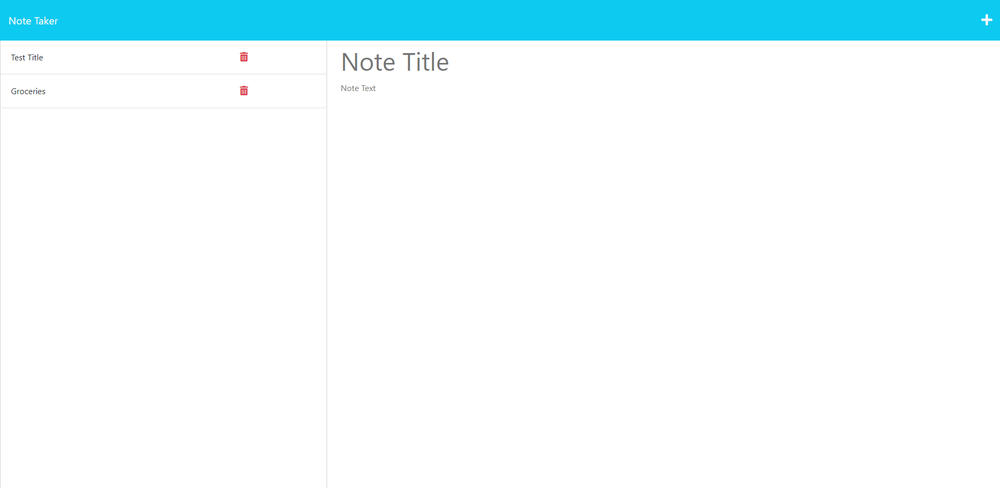

# Note Taker

## Description
Creating this project will help give me a better understanding of routes, such as, GET and POST. This project will be of great use for taking notes and saving them whenever I would like to look back. With the creation of this project I've also learned how to deploy an application to Heroku!

## Table of Contents
- [Installation](#installation)
- [Usage](#usage)
- [License](#license)
- [Questions](#questions)

## Installation
Deployed application on Heroku: [Link](https://pacific-citadel-19428-fa1222745f41.herokuapp.com/)

## Usage
This application can be used to help create notes and keep track of your notes. Click on the get started button then enter your note title and note text. Click on the save icon in the top right and your notes are saved!

## License

This application is covered under the MIT license.

## Questions
GitHub: [turbdorb](https://github.com/turbdorb)

Email: <brymerjared@gmail.com>
